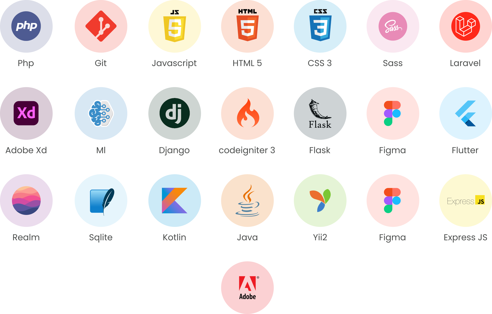

<p align="center" style="font-size:40px;font-weight:bold;">
STARTCODE ID
</p>

<p align="center">

  
</p>

<p align="left" style="font-size:20px;font-weight:bold;">
About
</p>

StartCode is a dynamic IT services company dedicated to meeting the diverse technological needs of businesses. With a strong focus on delivering tailored solutions, StartCode specializes in three key service areas (Software Development, IT Outsourcing and Technology Expertise).  

- <p align="left" style="font-size:15px;font-weight:bold;">Software development</p>
<p align="justify">StartCode excels in crafting cutting-edge software solutions to address the unique requirements of your business. Our team of skilled professionals is proficient in a range of programming languages, including Java, Python, JavaScript, Golang, PHP, and more. We are committed to staying abreast of the latest industry trends, ensuring that our clients benefit from the most advanced and efficient software applications.  
</p>
- <p align="left" style="font-size:15px;font-weight:bold;">IT outsourcing</p>
IT outsourcing is a core offering at StartCode, where we provide external expertise and services to manage your IT needs. By outsourcing IT tasks to our team of seasoned professionals, your business can reduce costs, gain access to specialized skills, and concentrate on core activities. We strive to be your reliable partner, handling IT-related responsibilities while you focus on strategic business objectives.  


- <p align="left" style="font-size:15px;font-weight:bold;">Technology Expertise</p>
StartCode prides itself on its proficiency in various technologies and programming languages. Our team remains updated with the latest industry trends, ensuring that your projects benefit from the most innovative and effective solutions.  Getting Started: Ready to explore the possibilities with StartCode? Initiating our services is a straightforward process. Simply reach out to us through our website or contact us directly, and we'll promptly schedule a consultation. During this consultation, we'll delve into your project, discuss your goals, and outline how StartCode can play a pivotal role in turning your vision into reality. We look forward to collaborating with you on your journey to technological excellence.


<p align="center" style="font-size:30px;font-weight:bold;">Tech Stack</p>


## Tech

Dillinger uses a number of open source projects to work properly:

- [AngularJS] - HTML enhanced for web apps!
- [Ace Editor] - awesome web-based text editor
- [markdown-it] - Markdown parser done right. Fast and easy to extend.
- [Twitter Bootstrap] - great UI boilerplate for modern web apps
- [node.js] - evented I/O for the backend
- [Express] - fast node.js network app framework [@tjholowaychuk]
- [Gulp] - the streaming build system
- [Breakdance](https://breakdance.github.io/breakdance/) - HTML
to Markdown converter
- [jQuery] - duh

And of course Dillinger itself is open source with a [public repository][dill]
 on GitHub.

## Installation

Dillinger requires [Node.js](https://nodejs.org/) v10+ to run.

Install the dependencies and devDependencies and start the server.

```sh
cd dillinger
npm i
node app
```

For production environments...

```sh
npm install --production
NODE_ENV=production node app
```

## Plugins

Dillinger is currently extended with the following plugins.
Instructions on how to use them in your own application are linked below.

| Plugin | README |
| ------ | ------ |
| Dropbox | [plugins/dropbox/README.md][PlDb] |
| GitHub | [plugins/github/README.md][PlGh] |
| Google Drive | [plugins/googledrive/README.md][PlGd] |
| OneDrive | [plugins/onedrive/README.md][PlOd] |
| Medium | [plugins/medium/README.md][PlMe] |
| Google Analytics | [plugins/googleanalytics/README.md][PlGa] |

